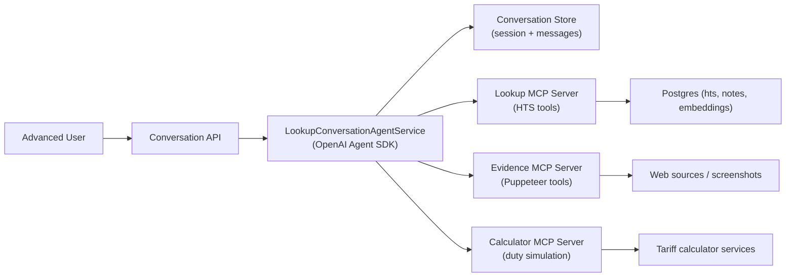

# HTS Advanced Conversation Design (OpenAI Agent SDK + MCP)

Date: 2026-02-22  
Service: `hts-service`  
Scope: advanced conversational experience for power users, separate from direct endpoint calls (`autocomplete`, `search`, `classify`).

## 1. Objective

Provide an expert-style conversational workflow for customs/broker users who need:
1. multi-turn clarification,
2. transparent evidence,
3. what-if comparison across plausible HTS candidates,
4. optional web/visual evidence collection for ambiguous products.

This mode complements, not replaces, current deterministic endpoints.

## 2. Primary Users

1. Customs brokers handling ambiguous descriptions.
2. Trade compliance analysts validating alternatives before filing.
3. Internal support users who need an auditable reasoning trail.

## 3. User Experience (Conversation Style)

User can ask naturally:
1. `Need HTS for transformer comic book imported as monthly release.`
2. agent asks targeted clarifying questions (page count, periodical status, format).
3. user answers incrementally.
4. agent returns:
   - recommended HTS,
   - top alternatives,
   - confidence,
   - missing evidence,
   - rationale and citations.

For ambiguous intents (example comic vs periodical), the agent must ask for disambiguators before finalizing.

## 4. Architecture



## 5. Agent Runtime Design

Use OpenAI Agent SDK as the orchestration layer:
1. Agent maintains thread/session context per conversation.
2. Tool execution is MCP-based (no direct DB access from model).
3. Structured final response schema is enforced per turn.
4. Streaming token responses supported for UX.

Reuse existing patterns from:
1. `/src/modules/extension/services/agent-orchestration.service.ts`
2. `/src/modules/extension/mcp/servers/puppeteer-server.ts`

But migrate from manual chat loop to Agent SDK run lifecycle.

## 6. MCP Tooling Plan

## 6.1 New `LookupMCPServer` (read-only HTS intelligence)

Tools:
1. `hts_lookup_exact`
   - input: `htsNumber`
   - output: full HTS row + hierarchy + notes summary.
2. `hts_search_hybrid`
   - input: `query`, `limit`, `filters`
   - output: ranked candidates with lexical/semantic signals.
3. `hts_autocomplete`
   - input: `query`, `limit`
   - output: lightweight candidate list.
4. `hts_compare_candidates`
   - input: `query`, `candidateCodes[]`
   - output: side-by-side evidence matrix.
5. `hts_get_notes`
   - input: `htsNumber`, `year`
   - output: resolved notes and references.

## 6.2 Existing `PuppeteerMCPServer` (already present)

Use only when needed:
1. `fetch_page`
2. `scrape_with_puppeteer`
3. `capture_screenshot`

## 6.3 Optional `CalculationMCPServer`

Tools for advanced users:
1. `simulate_duty`
   - input: `htsNumber`, origin, value, trade-program flags.
   - output: duty estimate + assumptions.
2. `compare_duty_scenarios`
   - input: multiple candidate HTS codes.
   - output: side-by-side rate impact.

## 7. Conversation API Design

Base: `/api/v1/lookup/conversations`

1. `POST /api/v1/lookup/conversations`
   - create session with metadata (`organizationId`, user profile, language).
2. `POST /api/v1/lookup/conversations/:conversationId/messages`
   - submit user turn; returns streamed assistant response.
3. `GET /api/v1/lookup/conversations/:conversationId`
   - conversation summary/state.
4. `GET /api/v1/lookup/conversations/:conversationId/messages`
   - paginated message history.
5. `POST /api/v1/lookup/conversations/:conversationId/feedback`
   - user marks correct/incorrect recommendation for learning queue.

## 8. Response Contract (per assistant turn)

```json
{
  "answer": "...",
  "recommendedHts": "4901.99.00.93",
  "alternatives": [
    { "hts": "4901.99.00.92", "reason": "..." },
    { "hts": "4902.90.20", "reason": "..." }
  ],
  "confidence": 0.73,
  "needsClarification": true,
  "clarificationQuestions": [
    "How many interior pages (excluding covers)?",
    "Is this a periodical/journal issue?"
  ],
  "evidence": [
    { "type": "hts", "source": "db", "ref": "4901.99.00.92" },
    { "type": "note", "source": "db", "ref": "chapter-note-..." }
  ],
  "toolTrace": ["hts_search_hybrid", "hts_compare_candidates"]
}
```

## 9. Guardrails and Safety

1. Tool allowlist per endpoint; no arbitrary tool execution.
2. Read-only MCP tools for lookup path.
3. Prompt-injection defense:
   - treat scraped page text as untrusted data,
   - never execute instructions from retrieved content.
4. If confidence < threshold or ambiguity unresolved:
   - no hard final code,
   - return `needsClarification=true`.
5. Log tool calls and output hashes for audit.

## 10. Persistence Model

New tables:
1. `lookup_conversation_session`
   - `id`, `organization_id`, `created_by`, `status`, `context_json`, timestamps.
2. `lookup_conversation_message`
   - `id`, `session_id`, `role`, `content_json`, `tool_trace_json`, `token_usage`, timestamps.
3. `lookup_conversation_feedback`
   - `id`, `session_id`, `message_id`, `is_correct`, `chosen_hts`, `comment`.

## 11. Observability and Cost Controls

1. Metrics:
   - turn latency p50/p95,
   - tool calls per turn,
   - clarification rate,
   - final recommendation acceptance rate.
2. Budgets:
   - max iterations per turn,
   - max tool calls per turn,
   - token caps and graceful fallback.
3. Caching:
   - repeated HTS details and notes by key.

## 12. Evaluation Plan (Conversation-Specific)

Build `conversation-eval-set` (100-200 dialogues):
1. ambiguous commodity dialogues (comic/book/periodical class).
2. sparse user inputs requiring clarifications.
3. adversarial/prompt-injection attempts.

Metrics:
1. final HTS top-1 accuracy,
2. clarification precision (asks when truly needed),
3. citation completeness,
4. hallucination rate,
5. user-accepted recommendation rate.

## 13. Rollout Plan

1. Phase A: internal beta (`advanced=true`) for admin users.
2. Phase B: selected customers behind feature flag.
3. Phase C: GA with SLA + monitoring alerts.

Rollback:
1. disable conversation flag,
2. fall back to existing `search/classify` endpoints.

## 14. Integration with Current Refactor

This design sits on top of the lookup quality work:
1. uses improved `search`/`classify` as core tools,
2. consumes ambiguity-aware evaluation logic,
3. adds conversational decision policy without changing existing endpoint contracts.
